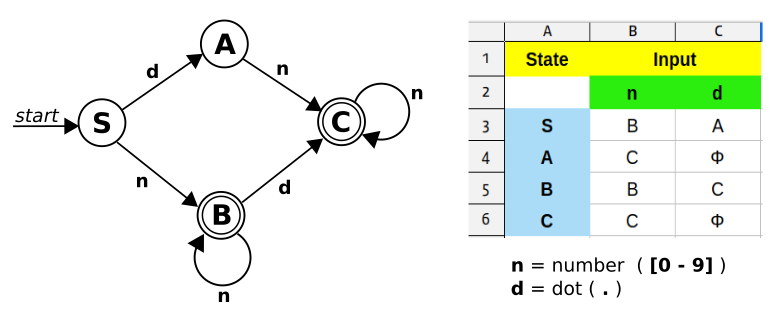

# Lexical Analyzer

소스코드에서 토큰을 분리해 낼 때도 automaton 을 만들어서 기계적으로 처리할 수 있습니다.
`LR_parser.c` 에서는 NUMBER 토큰을 분리할 때 단순히 숫자와 `.` 문자만 허용을 해서
`.12.34` `1.234.` `12..34` `.123.` `.` 와 같은 값들이 오류 없이 입력이 되는데요.
아래서 작성한 automaton 을 이용하면 python 에서처럼 `12.345` `.123` `123.` 형태만 허용이 됩니다.
lexical analyzer 에서는  regular grammar 가 사용됩니다.


- 강승식 교수님의 Finite State Automata 강좌 
    1. [유한오토마타 소개](https://www.youtube.com/watch?v=TzXOj-XRC-U&list=PLywg83lhcrgDvPgTr-xatGWSe6YYnDevz&index=113)
    2. [유한오토마타 NFA - DFA 변환](https://www.youtube.com/watch?v=AZQV8nFoVts&list=PLywg83lhcrgDvPgTr-xatGWSe6YYnDevz&index=114&t=2s)
    3. [유한오토마타 eNFA - DFA 변환](https://www.youtube.com/watch?v=NWmHcr5oGAU&list=PLywg83lhcrgDvPgTr-xatGWSe6YYnDevz&index=115&t=15s)
    4. [eNFA - DFA 변환](https://www.youtube.com/watch?v=cBTXRaupF9k&list=PLywg83lhcrgDvPgTr-xatGWSe6YYnDevz&index=117)
    5. [유한오토마타 DFA 최적화](https://www.youtube.com/watch?v=6mdKCBX4kdA&list=PLywg83lhcrgDvPgTr-xatGWSe6YYnDevz&index=116), ([참조](https://www.youtube.com/watch?v=53qT4NZ3nOo&list=PLywg83lhcrgDvPgTr-xatGWSe6YYnDevz&index=112))

- Thomson's and Subset Construction 을 이용해 RE 을 DFA 로 변환하는 방법  
    1. [Constructing NFA using Thompson's construction Ex.1](https://www.youtube.com/watch?v=DryssBQeOaM&list=PLywg83lhcrgDvPgTr-xatGWSe6YYnDevz&index=107)
    2. [Constructing NFA Using Thompson's Construction Ex.2](https://www.youtube.com/watch?v=tPBh8MOw8_Y&list=PLywg83lhcrgDvPgTr-xatGWSe6YYnDevz&index=108)
    3. [RE to DFA using Thomson's and Subset Construction Ex.1](https://www.youtube.com/watch?v=vt2x0W_jcPU&list=PLywg83lhcrgDvPgTr-xatGWSe6YYnDevz&index=109)
    4. [RE to DFA using Thompson's and Subset Construction Ex.2](https://www.youtube.com/watch?v=BgcBmdU_KOQ&list=PLywg83lhcrgDvPgTr-xatGWSe6YYnDevz&index=110)


- Regular expression 을 입력하면 자동으로 transition 테이블을 만들어주는 사이트  
https://cyberzhg.github.io/toolbox/min_dfa





```c
/*
 *   LR_parser.c 파일에서 next_token 함수를 아래의 코드로 변경해 사용.
 */
// 위에서 작성한 테이블 값을 그대로 array 로 변환한 것입니다.
const char lex_table[4][2] = {
    2, 1,
    3, 0,
    2, 3,
    3, 0
};

token_t *next_token () 
{
    static int cpos = 0;
    double value;
    enum token_type type;
    char buf[20] = {}; 

next_token :
    if (cpos >= strlen (input_str))
        return NULL;
    int i, j;
    int cur_stat = 0; 
    switch (input_str[cpos]) 
    {
        case '(' : value = '('; type = LPAREN;   break;
        case ')' : value = ')'; type = RPAREN;   break;
        case '+' : value = '+'; type = PLUS;     break;
        case '-' : value = '-'; type = MINUS;    break;
        case '*' : value = '*'; type = ASTERISK; break;
        case '/' : value = '/'; type = SLASH;    break;
        case '%' : value = '%'; type = PERCENT;  break;
        case '^' : value = '^'; type = CARET;    break;
        case '1' : case '2' : case '3' : case '4' : case '5' :
        case '6' : case '7' : case '8' : case '9' : case '0' : case '.' :
                   i = cpos, j = 0; 
next_digit:                   
                   if (isdigit (input_str[i])) {                  // input char 가 숫자일 경우
                       cur_stat = lex_table[cur_stat][0];         // cur_stat 을 테이블 값에 따라 이동
                   } 
                   else if (input_str[i] == '.') {                // input char 가 "." 일 경우
                       cur_stat = lex_table[cur_stat][1];         // cur_stat 을 테이블 값에 따라 이동
                   } 
                   else {                                         // 그 밖의 문자는 마지막을 의미하므로
                        if (cur_stat == 2 || cur_stat == 3) {     // cur_stat 가 accept 인지 비교하고
                            buf[j] = '\0'; cpos = i - 1;          // ( accept : B = 2, C = 3 )
                            value = atof(buf); type = NUMBER;
                            break;
                        }                                         // 아닐 경우는 오류가 됩니다.
                        error_exit ("not a number");              // ( 예: 상태 A 에서 종료할 경우 )
                   }
                   if (cur_stat == 0)                             // cur_stat 이 테이블의 0 값을 가리키면 오류.
                       error_exit ("not a number");               // ( 예: 상태 A or C 에서 "." 이 입력될 경우 )
                   buf[j++] = input_str[i++]; 
                   goto next_digit;

        default  : cpos += 1; goto next_token;
    }
    cpos += 1;
    struct token *p = malloc (sizeof (struct token));
    p->value = value;
    p->type = type;
    return p;
}
```
