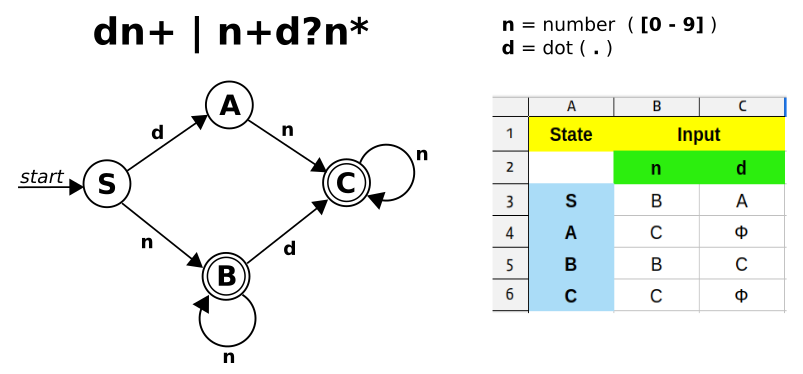

# Lexical Analyzer





```c
// 위에서 작성한 테이블 값을 그대로 array 로 변환한 것입니다.
const char lex_table[4][2] = {
    2, 1,
    3, 0,
    2, 3,
    3, 0
};

token_t *next_token () 
{
    static int cpos = 0;
    double value;
    enum token_type type;
    char buf[20] = {}; 

next_token :
    if (cpos >= strlen (input_str))
        return NULL;
    int i, j;
    int cur_stat = 0; 
    switch (input_str[cpos]) 
    {
        case '(' : value = '('; type = LPAREN; break;
        case ')' : value = ')'; type = RPAREN; break;
        case '+' : value = '+'; type = PLUS; break;
        case '-' : value = '-'; type = MINUS; break;
        case '*' : value = '*'; type = ASTERISK; break;
        case '/' : value = '/'; type = SLASH; break;
        case '%' : value = '%'; type = PERCENT; break;
        case '^' : value = '^'; type = CARET; break;
        case '1' : case '2' : case '3' : case '4' : case '5' :
        case '6' : case '7' : case '8' : case '9' : case '0' : case '.' :
                   i = cpos, j = 0; 
next_digit:                   
                   if (isdigit (input_str[i])) {                  // input char 가 숫자일 경우
                       cur_stat = lex_table[cur_stat][0];         // cur_stat 을 테이블 값에 따라 이동
                   } else if (input_str[i] == '.') {              // input char 가 "." 일 경우
                       cur_stat = lex_table[cur_stat][1];         // cur_stat 을 테이블 값에 따라 이동
                   } else {                                       // 그 밖의 문자는 마지막을 의미하므로
                        if (cur_stat == 2 || cur_stat == 3) {     // cur_stat 가 accept 인지 비교하고
                            buf[j] = '\0'; cpos = i - 1;          // ( accept : B = 2, C = 3 )
                            value = atof(buf); type = NUMBER;
                            break;
                        }                                         // 다를 경우는 오류가 된다.
                        error_exit ("not a number");              // ( 예: 상태 A 에서 종료할 경우 )
                   }
                   if (cur_stat == 0)                             // 테이블의 0 값을 가리키면 오류가 된다.
                       error_exit ("not a number");               // ( 예: 상태 A or C 에서 "." 이 입력될 경우 )
                   buf[j++] = input_str[i++]; 
                   goto next_digit;

        default  : cpos += 1; goto next_token;
    }
    cpos += 1;
    struct token *p = malloc (sizeof (struct token));
    p->value = value;
    p->type = type;
    return p;
}
```
